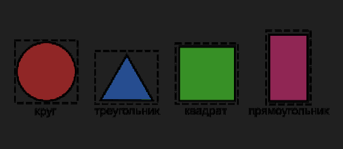

**Задание 2. Иерархия геометрических фигур**

**Что нужно сделать:**

Спроектируйте иерархию классов различных фигур: круг, квадрат, равносторонний треугольник, прямоугольник.

Для всех этих фигур есть общие поля-данные — это координаты их центра и условный цвет фигуры: красный, синий или зелёный.

Для отдельных фигур есть и уникальные параметры: радиус для круга, длина ребра для квадрата и равностороннего треугольника, ширина и высота для прямоугольника. Все данные — это вещественные числа с удвоенной точностью.

Для каждой из фигур требуется определить метод нахождения площади фигуры, а также метод нахождения прямоугольника, описывающего фигуру полностью (он может быть больше зоны фигуры, но не меньше).

Для лучшего понимания задачи приведена иллюстрация. На ней разными цветами помечены площади фигур, а пунктиром изображены прямоугольники, описывающие фигуры.
 

Для теста предусмотрите ввод пользователем команд: circle, square, triangle, rectangle, соответствующих фигурам. Команды должны получать параметры фигур и выводить их цвет, площадь и описывающий прямоугольник с координатами.

**Советы и рекомендации:**

Для цвета фигуры вы можете использовать собственный тип _enum_, в котором может содержаться и константа отсутствия цвета — _None_.

Площадь треугольника считается как length * length * std::sqrt(3) / 4; где length — сторона. Площадь круга — как atan(1) * 4 * radius;

Геометрические формулы вы можете найти в интернете.

**Что оценивается:**

Элегантность выстроенной иерархии классов. Корректность работы методов вычислений для фигур важна, но не столь принципиальна. 

**Как отправить задание на проверку:**

Пришлите ссылку на repl.it или файл .срр с решением через форму для сдачи домашнего задания.
