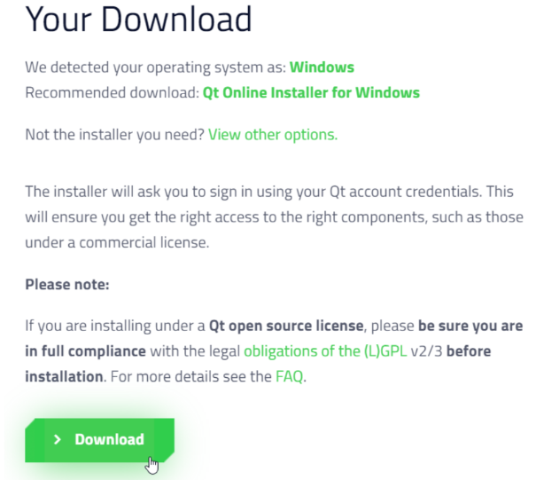

***Задание 1. Установка и настройка фреймворка Qt***

***Что нужно сделать:***
В соответствии с материалами видео скачайте, установите и настройте под CLion фреймворк и библиотеку Qt.

Скачайте онлайн-инсталлятор фреймворка с официального сайта:




Запустите инсталлятор, пройдите регистрацию на платформе Qt и установите последнюю минорную подверсию 5-й версии библиотеки.
После успешной установки пакета настройте его для работы в IDE CLion. Для этого нужно открыть файл проекта CMakeLists.txt и добавить в него соответствующие директивы:
```
set(CMAKE_PREFIX_PATH "C:/Qt/5.15.2/mingw81_64/lib/cmake")
```
```
find_package(Qt5 COMPONENTS
        Core
        Gui
        Widgets
        REQUIRED)
```
```
target_link_libraries(MySkillboxApp
        Qt5::Core
        Qt5::Gui
        Qt5::Widgets)
```