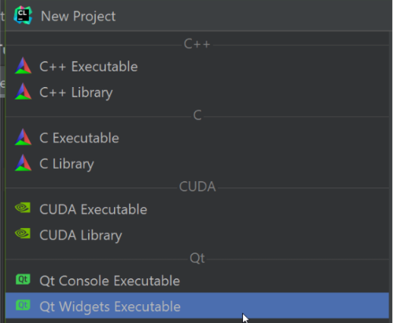

***Задание 2***

Создать новый проект из примера QT Widget:



В этом случае не забудьте удалить код под отладочную версию фреймворка, как это было показано в видео:
```
    if (CMAKE_BUILD_TYPE MATCHES "Debug")
        set(DEBUG_SUFFIX "d")
    endif ()
```