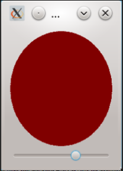

***Цель задания:***
Повторить работу с виджетами, которые были изучены в модуле.
(Отработать применение виджетов, которые были изучены в модуле.)

***Что нужно сделать:***
Давайте соберём все знания, полученные в данном модуле в одной программе. Для этого создадим приложение, которое содержит в окне круг, меняющий свой цвет в зависимости от положения ползунка. Если ползунок установлен в положение 0—33,  то круг имеет зелёный цвет, если 33—66 — жёлтый, далее красный. Такое приложение показано на следующем снимке:



1. Виджет, который рисует круг, можно сделать наследником QWidget. Теперь не надо переопределять keyPressEvent, как мы это сделали для кнопки во время урока. Мы лишь хотим рисовать виджет особым образом, реагировать на нажатия он не будет.
2. Нам потребуется три png-файла, которые соответствуют трём кружкам разных цветов (можете самостоятельно нарисовать их в Paint или взять готовые в материалах к уроку).
3. Чтобы расположить вертикально круг и ползунок (QSlider), нам потребуется добавить эти два виджета в QVBoxLayout (оба виджета расположены в каком-либо родительском QWidget, как было в примере с менеджерами компоновки).
4. Рекомендуем сделать для окна setFixedSize (200, 250), чтобы круг оставался кругом.
5. Метод minimumSizeHint может возвращать QSize(100, 100), а вот метод sizeHint можно не переопределять.
6. Удобно будет иметь три метода для смены цвета. Они будут напоминать методы опускания/поднятия кнопки из примера с красной кнопкой. Один из них может выглядеть так:
```
void ColorfulCircle::setYellow() {
    mCurrentCircle = mYellowCircle;
    update();
}
```
7. Чтобы связать изменения значений слайдера с цветом круга, можно написать небольшую лямбда-функцию. Она будет проверять диапазон, в который попадает новое значение, и устанавливать соответствующий ему цвет, меняя картинку на одну из трёх. Пример такого связывания и заголовок функции могут выглядеть так:
```
QObject::connect(&slider, &QSlider::valueChanged, [&slider, &circle](int newValue)
{ //Тут проверка диапазона и установка цвета круга });
```
Где circle — это ваш виджет. Обратите внимание, что мы захватываем адреса ползунка и круга. Так же мы обрабатываем новое значение от ползунка, указав в аргументах функции int newValue. Это значение мы будем проверять на попадание в диапазон при помощи if/else.


***Критерии оценки:***
 - Приложение отображает одно окно, в котором есть цветной круг и ползунок.
 - При перемещении ползунка цвет круга меняется: первая треть диапазона ползунка — зелёный цвет круга, вторая — жёлтый, третья — красный.

На проверку необходимо отправить один .cpp-файл и один CMakeLists.txt-файл. За основу желательно взять проект с кнопкой, который был разобран в модуле.


***Как отправить задание на проверку:***
Пришлите ссылку на repl.it или файл .срр с решением через форму ниже.