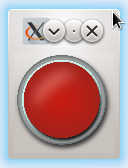

**Задание 1. Добавление звука для красной кнопки**

   **Что нужно сделать:**
   Вспомните программу с красной кнопкой, которая изменяет свой внешний вид.

При помощи QMediaPlayer добавьте звук щелчка или любой другой звук, возникающий при нажатии на кнопку.

**Что оценивается:**
Приложение отображает одно окно, в котором есть красная кнопка.
При нажатии кнопка принимает вид нажатой, воспроизводится звук нажатия на кнопку.