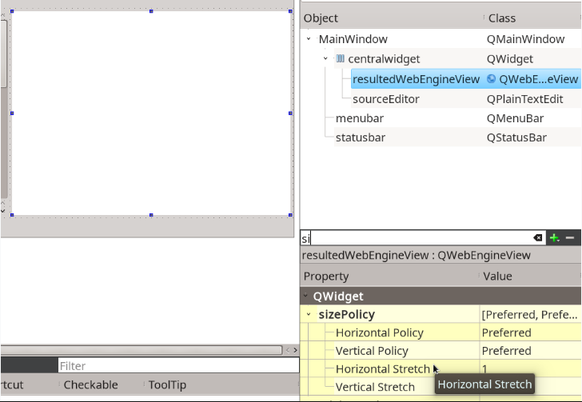

**Задание 2. Создание приложения для редактирования HTML-файла**
   
**Что нужно сделать:**
Создайте приложение, в котором окно делится на две половины. В левой половине можно редактировать HTML-документ, а в правой — видеть результат WebView.

**Пример такого приложения:**

Можете использовать Qt Creator и Qt Designer, чтобы быстро добавить два элемента:

- QPlainTextEdit для редактирования текста,
- QWebEngineView для отображения результата.

Необходимо, чтобы каждый из виджетов занимал равное количество пространства по горизонтали и всё — по вертикали.

1. Выделите оба виджета. Зажмите Ctrl и щёлкните сначала по одному из виджетов, а затем по второму. Нажмите «Расположить по горизонтали» или Lay out horizontally.

3. Для каждого из виджетов найдите параметр Horizontal Stretch и сделайте его равным единице.

Можете выполнить те же действия без использования Qt Designer.

Для этого с помощью функции setSizePolicy у виджета задайте свойство sizePolicy. Это свойство класса QWidget имеет тип QSizePolicy и задаёт поведение виджета при изменении его размера.

Приложение должно реагировать на изменения текста слева, сразу полностью перестраивая представление HTML-документа справа.

**Рекомендация:**
Если вы используете Windows, то учтите, что библиотека QtWebView существует только для компилятора MSVC (Microsoft Visual Studio).

**Что оценивается:**
Приложение отображает одно окно, в котором есть два текстовых виджета.
Каждый виджет занимает свою половину экрана.
Левый виджет содержит текстовое представление HTML-документа, правый — нарисованную веб-страницу.
При изменении исходного кода страницы в левом виджете представление в правом сразу меняется.