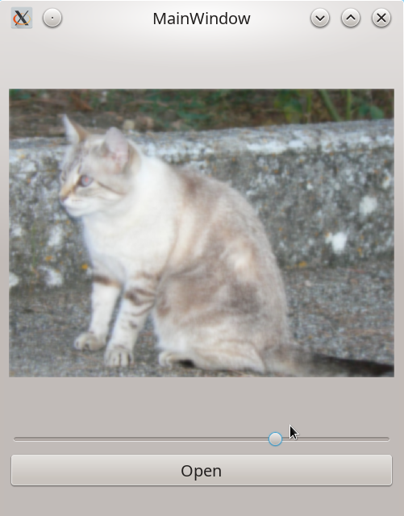

**Задание 3.Создание приложения, которое позволяет наложить Blur-эффект**

**Что нужно сделать:**
Создайте приложение, которое позволяет открыть картинку и наложить Blur-эффект. Глубина наложения должна варьироваться при помощи слайдера.

Пример приложения:



Можете использовать Qt Creator и Qt Designer, чтобы быстро добавить три виджета:

 - QLabel для отображения картинки;
 - QSlider для установления глубины blur: для этого выберите min слайдера 0, а max — 10;
 - кнопку QPushButton для открытия диалога выбора картинки.
Используйте файловый диалог из задания про медиаплеер. Виджеты можно расположить по вертикали одной кнопкой в Qt Designer, как это было в предыдущем задании.

При перемещении слайдера к изображению применяется эффект с нужной величиной blurRadius. Воспользуйтесь функцией из примера, в котором применялся QtConcurrent. Эта величина всегда равнялась восьми. Необходимо вынести её в аргументы функции примерно таким образом:
```
QImage blurImage(QImage source, int blurRadius);
```
Установить картинку из функции в label можно так:
```
ui->imageLabel->setPixmap(QPixmap::fromImage(blurImage(sourceImage, newValue).scaled(
ui->imageLabel->width(),
ui->imageLabel->height(), Qt::KeepAspectRatio)));
```
**Рекомендация:**
ImageLabel — label, в который необходимо загрузить картинку. Использование метода scaled позволяет изменять размеры изображения. В данном случае нужно сжать изображение под размер, который занимает label, с сохранением соотношения сторон (Qt::KeepAspectRatio).

**Что оценивается:**
Приложение отображает одно окно с кнопкой и слайдером.
При нажатии на кнопку появляется диалог выбора файлов, в котором можно выбирать файлы JPG. При выборе файл отображается в приложении.
При перемещении ползунка изображение получает Blur-эффект.
