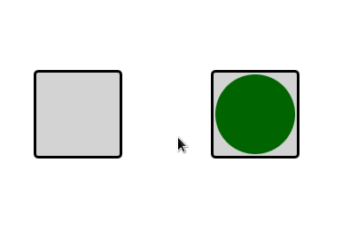

**Задание 1. Создание приложения, позволяющего перемещать круг по холсту**


**Что нужно сделать:**
Вспомните программу, которая перемещала круг от центра одного прямоугольника к центру другого.





Можно взять её за основу, доработав следующее:

При нажатии на левый квадрат круг перемещается на небольшое расстояние в сторону правого квадрата (без анимации).
При достижении правого квадрата (его центра или любого края) круг возвращается в исходное положение (внутри левого квадрата) с любой анимацией на ваше усмотрение.
При нажатии на правый квадрат круг возвращается в исходное положение (также с анимацией).


**Что стоит учесть:**
Чтобы переместить круг, достаточно в обработчике onClicked написать ball.x += 30.

Для создания анимации потребуется как минимум два состояния — исходное и промежуточное. Исходное состояние можно получить способом, который вы применяли на практике. Получение промежуточного состояния потребует некоторой хитрости: координата в нём будет накапливаться каждый раз, когда мы делаем x += 30. Чтобы избежать этого, можно написать код так:
```
State {
	name: "OtherState"
	PropertyChanges {
	   target: ball
	   x: ball.x
	}
}
```
Переход будет только один — из промежуточного в исходное состояние:
```
Transition {
	from: "OtherState"
	to: "InitialState"

	NumberAnimation {
	   properties: "x,y"
	   duration: 1000
	   easing.type: Easing.OutBounce
	}
}
```


Вам нужно проверять координату круга при каждом нажатии на квадрат:

```
	if(ball.x >= rightRectangle.x)
```

В одном случае вы увеличиваете координату и меняете состояние, а в другом — перемещаете круг в исходное положение (меняете состояние на исходное).

Внутри квадратов хорошо бы разместить надписи «move» и «return» соответственно. Например, при помощи элементов Text:
```
Text {
	id: name
	anchors.centerIn: parent
	text: "move"
}
```

**Критерии оценки:**
 - Приложение отображает одно окно, в котором есть два квадрата и круг.
 - При нажатии на левый квадрат круг перемещается в сторону правого квадрата на произвольное количество пикселей.
 - При нажатии на правый квадрат круг возвращается в исходное положение.
 - При достижении кругом любой стороны правого квадрата или его центра круг возвращается в исходное положение с анимацией.


**Как отправить задание на проверку:**
Пришлите один файл qml. За основу желательно взять проект с анимациями, рассмотренный на уроке. Через форму ниже пришлите ссылку на repl.it или файл CPP с решением.